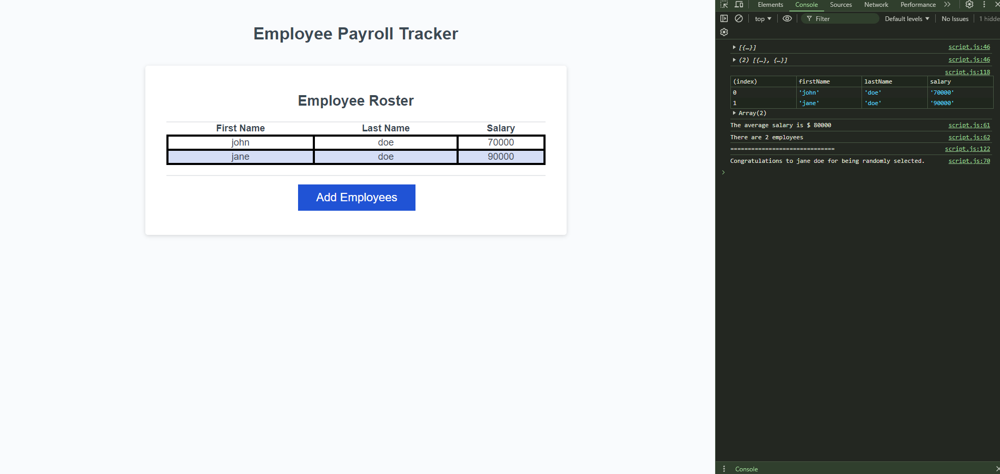

# PayrollTracker
A website where the user is able to click a button and respond to multiple prompts. The data is taken from those prompts to get a random employee and set up the average wage

## End product

## Resources
![While documentation] https://developer.mozilla.org/en-US/docs/Web/JavaScript/Reference/Statements/while
![isNaN function] https://developer.mozilla.org/en-US/docs/Web/JavaScript/Reference/Global_Objects/isNaN 
![return documentation] https://developer.mozilla.org/en-US/docs/Web/JavaScript/Reference/Statements/return
![Math.random documentation] https://developer.mozilla.org/en-US/docs/Web/JavaScript/Reference/Global_Objects/Math/random
## Deployed website and repository
![Deployed website] https://mattjhet.github.io/PayrollTracker/ 
![Github repository] https://github.com/MattJhet/PayrollTracker 